# Cascaded-SVM-on-FPGA
## Introduction
In this work, a Cascaded Support Vector Machine (SVM) classifier was designed
using Verilog HDL and tested on Artix-7 FPGA board to perform a binary classification of digits (either zero or one). A polynomial kernel was used in the first stage of the classifier and a hardware efficient alternative of the Gaussian Kernel, called the hardware-friendly kernel wasused in the second stage. Accuracy obtained using the hardware friendly kernel in Cascade was comparable to that obtained in existing implementations using the Gaussian kernel in Cascade. An accuracy of 98.83% was obtained on our Cascade SVM, which is higher than the accuracy offered by the Polynomial and Hardware-friendly kernels individually.

 
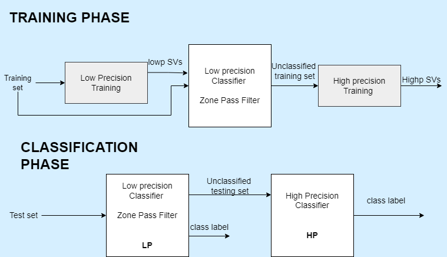
<b> Cascade SVM Training and Classification Flow </b> 

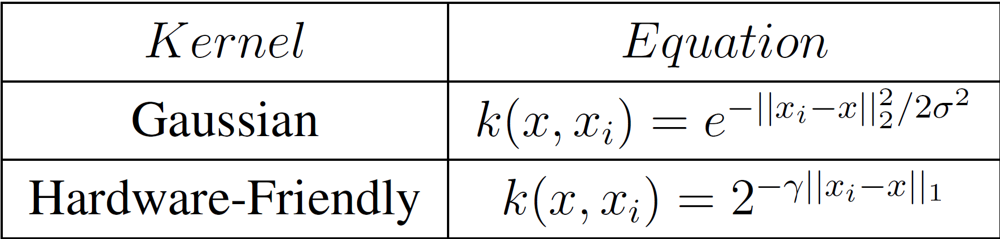
<b> Gaussian and Hardware-Friendly Kernel </b>

## Architecture
The block diagram of the stage 1 and stage 2 classifier architecture is shown below. The support vectors and test vector are fetched from the Block RAM
(BRAM) and fed as inputs to the kernel computation block. The kernel computations k(x; xi) for each SV are stored
in a register (kernel output register). Kernel computation corresponding to each SV is multiplied with coefficients obtained after training (alpha_i; yi). The multiplication results are finally fed to the decision function block.
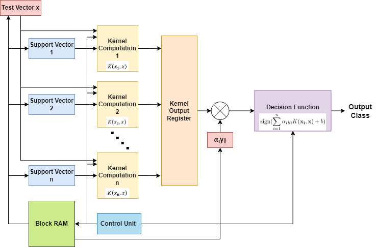
<b> Block Diagram of Each Classifier stage </b>

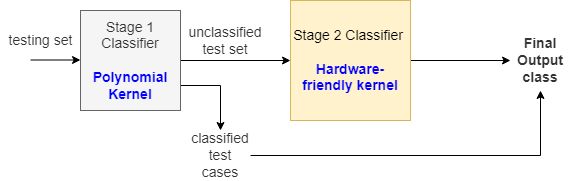
<b> Implementation Flow </b>

The decision function of the cascade classifier was formulated as denoted by equations below

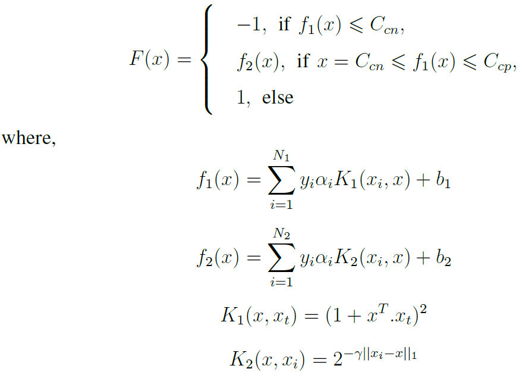
The threshold values Ccn and Ccp determine the size of the unclassified test set which will be fed to the powerful and more accurate stage 2 classifier. The unclassified test data from the polynomial kernel was fed to the powerful classifier with a Hardware Friendly kernel, whose implementation was mentioned ahead.

## Hardware Friendly Kernel
Hardware Friendly kernel is a CORDIC(Coordinate Rotation Digital Computer)- like algorithm for computing the output for a SVM classifier. This kernel is much
more hardware efficient than the Gaussian kernel, as it can be implemented without the use of multipliers which would add to the complexity of the computation. Instead, it can be implemented using barrel shifters and Adder/Subtractor blocks alone. 

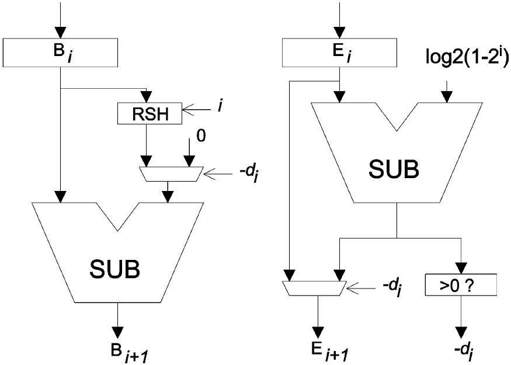
<b> Architecture for each step in Hardware Friendly Kernel computation </b>

The kernel computation block computes the following iterative equations for k iterations, where k equals to the number of bits required to represent the parameters.

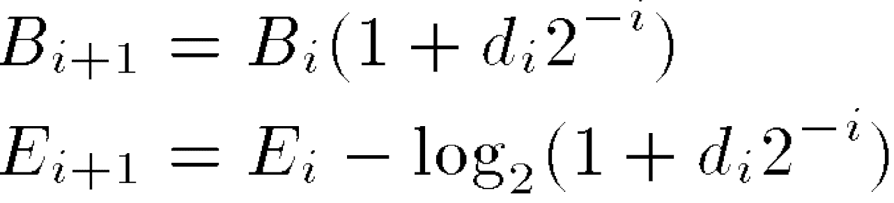

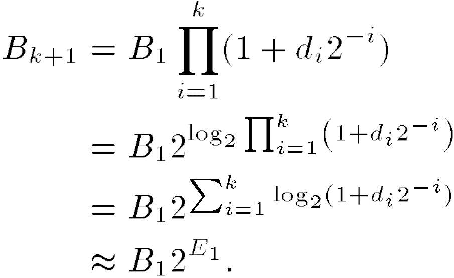

## Obtained Schematics
### Stage 1 Schematic (Polynomial Kernel)
A top module which instantiates and connects all other blocks for stage 1 Polynomial Kernel Classifier was made in Verilog and tested with a testbench file in Vivado Design suite.

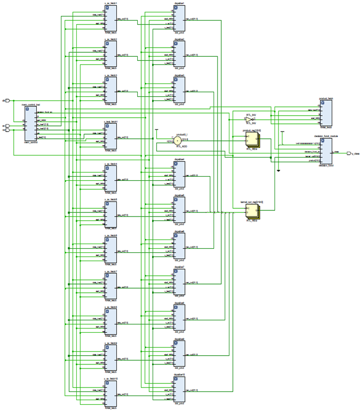
<b> Stage 1 Classifier block - RTL Schematic obtained in Vivado </b>

### Stage 2 Schematic (Hardware-Friendly Kernel)
stage 2 classifier also included a control unit for controlling memory read and module enable signals, in addition to the Kernel hardware friendly kernel computation block described above. The top module for stage 2 classifier instantiates these and connects them.
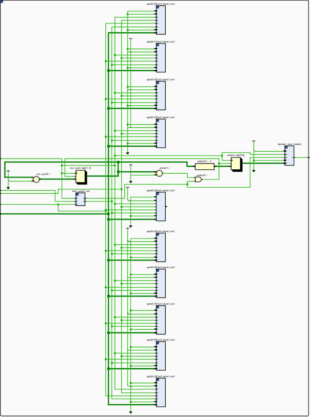
<b> Stage 2 Classifier block - RTL Schematic obtained in Vivado </b>

### Cascade Schematic
A top module which instantiates both the stages of the SVM Classifier was written in Verilog. The Stage 1 classifier is instantiated and entire test vector is set
is passed on to it. Depending on whether the decision function output of stage 1 for each test vector lies within the Ccn and Ccp thresholds, the signal `hwf en` is set to high, enabling the stage 2 hardware-friendly kernel for that particular test vector.
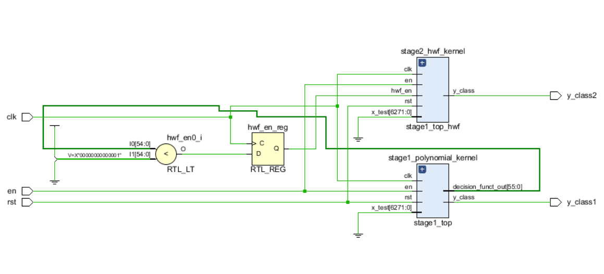
<b> Cascade Classifier - Top Module </b>
